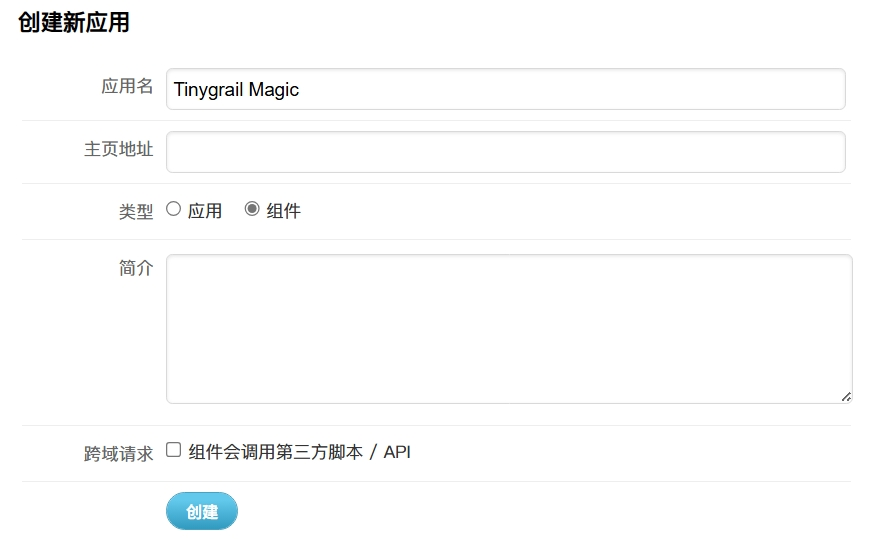
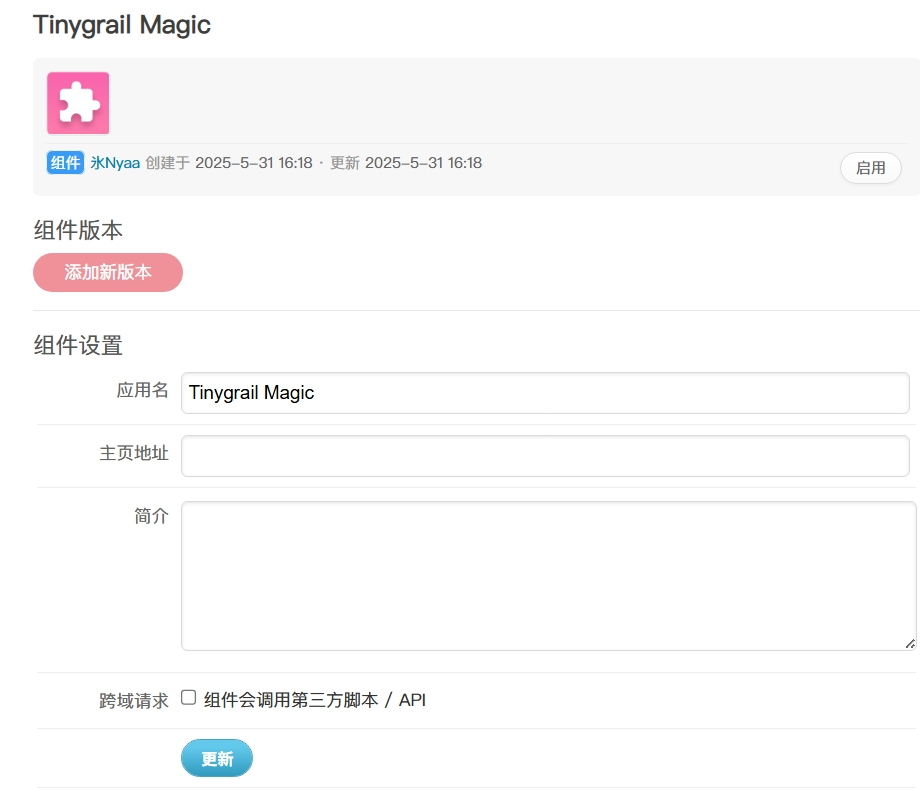
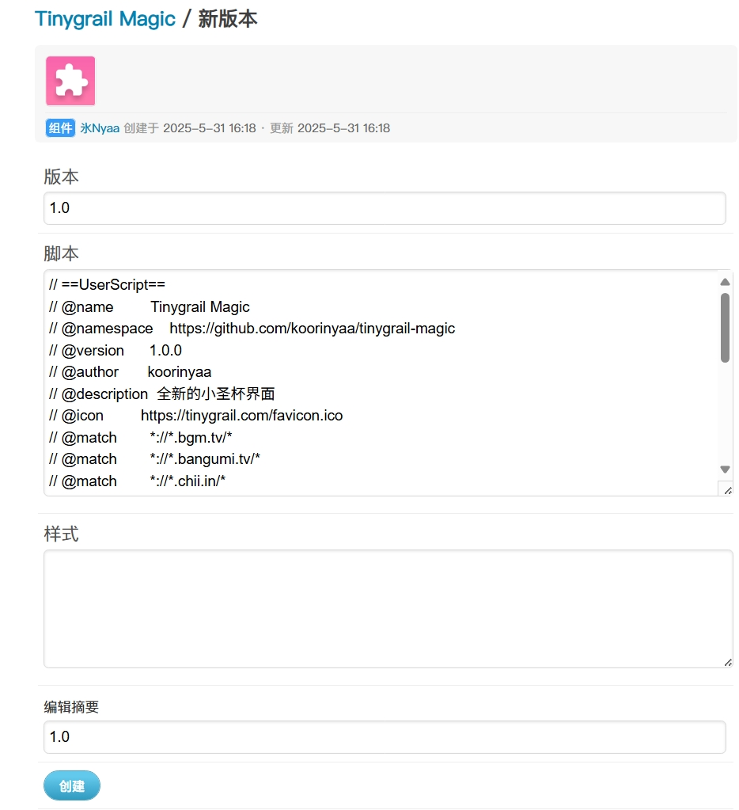
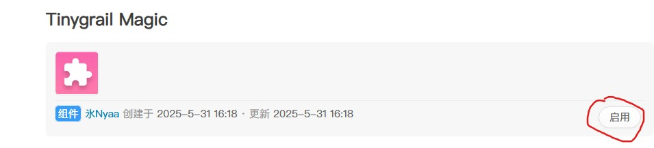
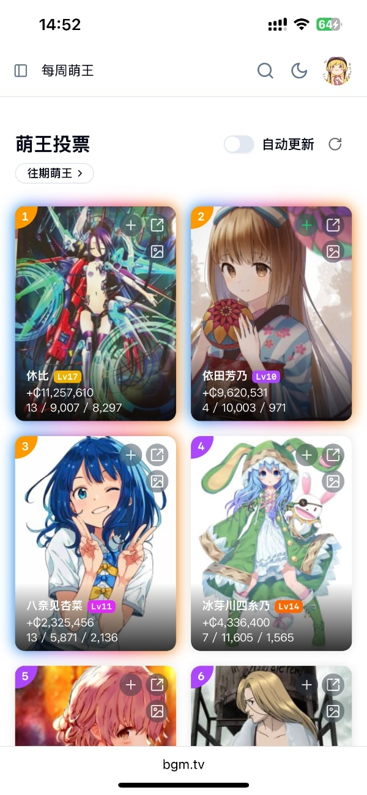
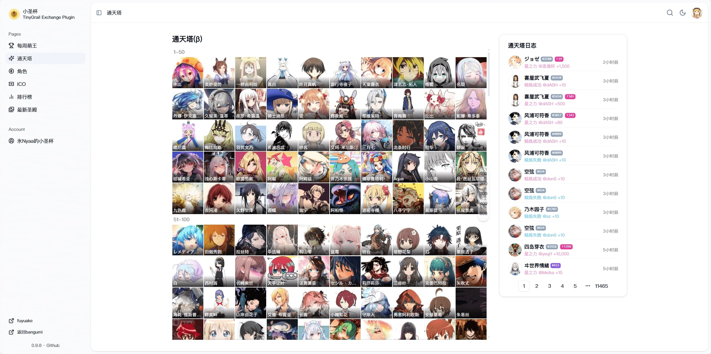

# Tinygrail Magic

全新的小圣杯界面，覆盖小圣杯绝大多数功能，适配 PC 与移动端，更流畅便捷的使用体验。

## 安装

- 提供超合金组件和Tampermonkey两种安装方式
- ⚠ 请不要同时安装两种版本

### 超合金组件

1. 根据你当前的bangumi域名打开对应的页面

- [https://bgm.tv/dev/app/create](https://bgm.tv/dev/app/create)
- [https://bangumi.tv/dev/app/create](https://bangumi.tv/dev/app/create)
- [https://chii.in/dev/app/create](https://chii.in/dev/app/create)

2. 应用名填 Tinygrail Magic
3. 类型选择组件
4. 点击创建

```js
Tinygrail Magic
```



5. 点击添加新版本



6. 版本和编辑摘要都填1.0
7. 复制下面代码粘贴至脚本区域
8. 点击创建

```js
// ==UserScript==
// @name         Tinygrail Magic
// @namespace    https://github.com/koorinyaa/tinygrail-magic
// @version      1.0.0
// @author       koorinyaa
// @description  全新的小圣杯界面
// @icon         https://tinygrail.com/favicon.ico
// @match        *://*.bgm.tv/*
// @match        *://*.bangumi.tv/*
// @match        *://*.chii.in/*
// ==/UserScript==

(async function () {
  if (window.location !== window.parent.location) {
    // if the script is running in an iframe, cancel the execution
    return
  }
  const script = document.createElement('script')
  script.type = 'text/javascript'
  script.src = 'https://cdn.jsdelivr.net/gh/koorinyaa/tinygrail-magic@main/dist/tinygrail-magic.user.js'
  script.async = true
  document.body.appendChild(script)
})()
```



9. 最后记得启动脚本



### Tampermonkey

需要浏览器装有 [Tampermonkey](https://tampermonkey.net/) 插件

[点击安装](https://cdn.jsdelivr.net/gh/koorinyaa/tinygrail-magic@main/dist/tinygrail-magic.user.js)

## 预览







